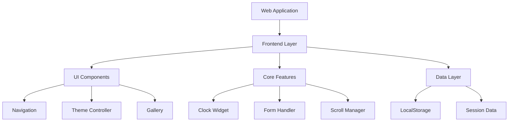

# 🚀 WebDev Foundations: My First JavaScript & jQuery Journey

<div align="center">
    
</div>

<br>

<div align="center">
  
[](https://developer.mozilla.org/en-US/docs/Web/HTML)
[](https://developer.mozilla.org/en-US/docs/Web/CSS)
[](https://developer.mozilla.org/en-US/docs/Web/JavaScript)
[](https://jquery.com/)

</div>

## About This Project

This repository represents my first hands-on experience with modern web development technologies. As a learning project, it demonstrates the practical implementation of HTML5, CSS3, JavaScript, and jQuery, showcasing my journey from concept to deployment.

## 🎯 Project Overview

A dynamic website that implements various frontend functionalities, serving as a practical learning ground for:
- DOM manipulation
- Event handling
- Local storage management
- jQuery plugin integration
- Responsive design principles

## 🛠️ Technologies Used

- **HTML5** - Semantic structure and modern web elements
- **CSS3** - Styling, animations, and responsive design
- **JavaScript (ES6+)** - Dynamic functionality and DOM manipulation
- **jQuery & jQuery UI** - Enhanced user interactions and UI components
- **Local Storage API** - Client-side data persistence
- **JSON** - Data structure and management

## ✨ Key Features

1. ### Dynamic Theme System
   - Light/Dark mode toggle
   - Persistent user preferences
   - Smooth transitions

2. ### Interactive Components
   - Image gallery with slider functionality
   - Accordion-style information sections
   - Real-time clock implementation
   - Smooth scroll animations

3. ### User Interface
   - Responsive design
   - Modern layout using CSS Grid and Flexbox
   - Interactive navigation
   - Contact form with validation

4. ### Data Management
   - Local storage implementation
   - Session handling
   - Dynamic content loading

## 📁 Project Structure

```
project/
├── index.html
├── assets/
│   ├── css/
│   │   ├── main.css
│   │   └── themes/
│   ├── js/
│   │   ├── app.js
│   │   └── components/
│   └── images/
├── libs/
│   └── jquery/
└── data/
    └── content.json
```

## 🏗️ Architecture



## 🚀 Getting Started

1. **Clone the repository**
```bash
git clone https://github.com/yourusername/webdev-foundations.git
```

2. **Navigate to project directory**
```bash
cd webdev-foundations
```

3. **Open in browser**
- Open `index.html` in your preferred browser
- Or use a local development server

## 💡 Learning Outcomes

Through this project, I've gained practical experience in:
- Building responsive layouts
- Implementing interactive UI components
- Managing client-side data
- Handling user events
- Integrating third-party libraries
- Writing clean, maintainable code

## 🔄 Future Improvements

- [ ] Enhance accessibility features
- [ ] Add more interactive components
- [ ] Implement additional jQuery plugins
- [ ] Optimize performance
- [ ] Add unit tests

## 📝 Notes

This is my first project working with these technologies. While striving for best practices, I welcome suggestions and feedback for improvement. The project serves as a foundation for my continued learning in web development.


## Demo
<a href="https://vimeo.com/1031422150?share=copy" target="_blank">
  
</a>


## 👨‍💻 Author

**Victor Robles**
- Website: [victorroblesweb.es](https://victorroblesweb.es)
- First project completed in [Current Year]

## 📄 License

This project is licensed under the MIT License - see the [LICENSE](LICENSE) file for details.

---

<div align="center">
  <p>Created as part of my web development learning journey.</p>
  <p>Feel free to use this as a reference for your own learning!</p>
</div>
